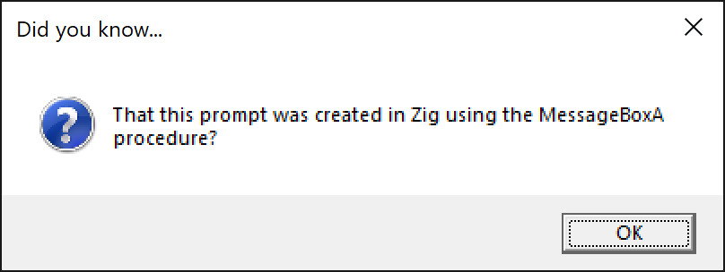
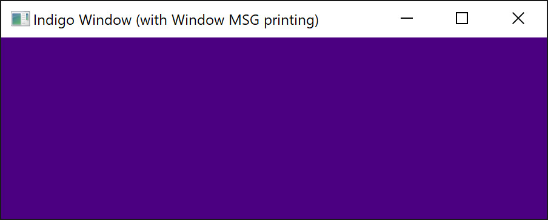
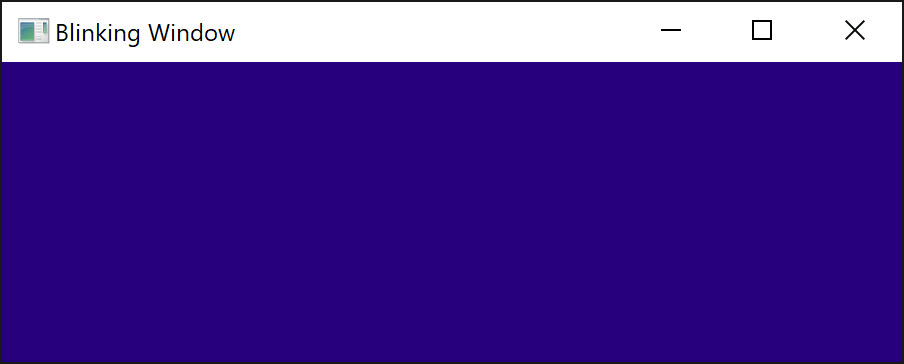

# Window Spawning Examples in Zig (for Windows OS)

This is a collection of elementary Zig programs that spawn windows on the Windows operating system from scratch.

Each program is self-contained; none rely on window-spawning libraries like GLFW or SDL.

## Building

The programs are trivial to build: simply call `zig build-exe FILENAME -Doptimize=ReleaseFast` where FILENAME is one of the project's `.zig` files. (E.g. `zig build-exe indigo-window.zig -Doptimize=ReleaseFast`.)

## [Question Prompt](./question-prompt.zig)

A Windows message box is spawned.

## [Indigo Window](./indigo-window.zig)

An window that is indigo in color prints out window messages it receives.

## [Blinking Window](./blinking-window.zig)

A window oscillates between pink and blue.

## Dependencies

The project has no library dependencies; each file contains all the code it needs to be compiled with the Zig `0.13.0` compiler on Windows 10+. The project has no need for a `build.zig.zon` file, or even a `build.zig` file.
